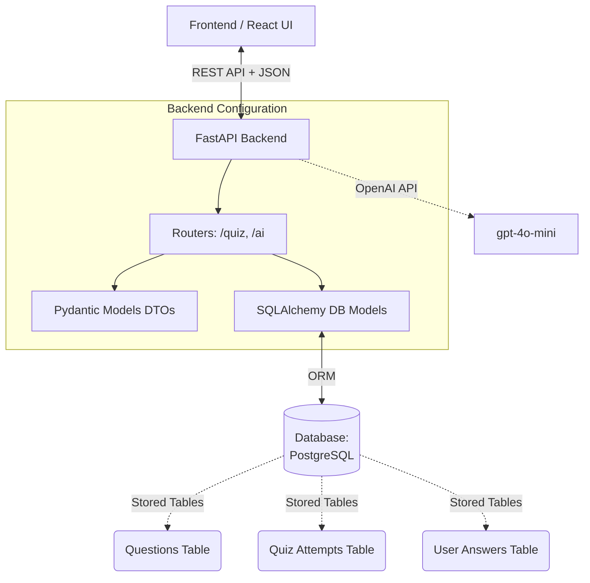

# Quiz Generation & Auto Evaluation Backend

This project serves as a comprehensive Backend API Proof-of-Concept for a scalable quiz generation and evaluation platform.

Built with **FastAPI**, **SQLAlchemy**, and **PostgreSQL**, this backend handles automatic question serving, submission evaluation, correct-answer validation, and includes an advanced AI integration capable of dynamically generating perfectly formatted multiple-choice questions on demand.

---

## 🏗️ 1. Architecture Overview



### Technology Stack
- **Framework**: FastAPI
- **Database**: PostgreSQL 
- **ORM**: SQLAlchemy 
- **AI Integration**: OpenAI SDK (`gpt-4o-mini` with strict Structured Outputs)

---

## 🗄️ 2. Database Design 

The system uses three tables to track quiz sessions:

1. **`questions` Table**: The repository of all available questions.
2. **`quiz_attempts` Table**: Master record tracking an individual student's total score for a quiz session.
3. **`user_answers` Table**: Granular tracking associating a student's guess with the exact question asked and whether they were correct.

---

## 🚀 3. Core API Endpoints

Explore and test all APIs interactively via Swagger UI by navigating to `http://localhost:8000/docs`.

### Flow 1: Taking a Quiz
**`GET /quiz/start?difficulty=medium`**
- Initializes a new `QuizAttempt`. Fetches up to 10 randomized questions from the PostgreSQL database according to the difficulty requested.
- Omits the `correct_answer` field to prevent client-side cheating.

### Flow 2: Submitting & Auto-Evaluating
**`POST /quiz/submit`**
- Receives an array of the user's `question_id` and their `selected_answer`.
- The API queries the Database for the true `correct_answer`, compares the strings, calculates the integer `score`, and inserts each guess into the `user_answers` table. Finally, it updates the `QuizAttempt` total score.
- Returns ONLY the final strict score (e.g., `{ "score": 8, "total": 10}`).

### Flow 3: Detailed Scorecard
**`GET /quiz/result/{quiz_id}`**
- Retrieves the master attempt, joins the `user_answers` to the original `questions` table, and returns an exhaustive JSON array showing exactly what the user selected versus what the correct answer was.

### Flow 4: Dynamic AI Question Generation
**`POST /ai/generate-question`**
- Pings OpenAI `gpt-4o-mini` using **Structured Outputs** to force the LLM to reply exactly in the shape of our SQLAlchemy schema.
- Automatically inserts the newly minted question directly into your PostgreSQL database so it is available for future quizzes.

---

## 💻 4. Local Developer Setup Guide

To run this server locally on your machine for further development:

1. **Activate Environment**:
   ```bash
   cd backend
   source .venv/bin/activate
   ```
2. **Setup Dependencies**:
   ```bash
   pip install -r requirements.txt
   ```
3. **Environment Setup**:
   Ensure you have a `.env` file in the `backend` folder containing your API Key:
   ```env
   OPENAI_API_KEY=sk-proj-...
   DATABASE_URL=postgresql://mukeshkanna@localhost/quiz_poc
   ```
4. **Database Seeding**:
   To initialize or reset the tables with sample questions, run:
   ```bash
   export PYTHONPATH=. && python seed.py
   ```
5. **Start the FastAPI Server**:
   ```bash
   uvicorn main:app --reload
   ```
